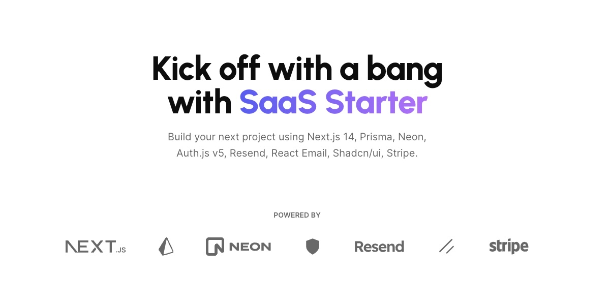

<a href="https://next-saas-stripe-starter.vercel.app">
  
  <h1 align="center">Next SaaS Stripe Starter</h1>
</a>

<p align="center">
  Start at full speed with SaaS Starter !
</p>

<p align="center">
  <a href="https://twitter.com/miickasmt">
    
  </a>
</p>

<p align="center">
  <a href="#introduction"><strong>Introduction</strong></a> ·
  <a href="#installation"><strong>Installation</strong></a> ·
  <a href="#tech-stack--features"><strong>Tech Stack + Features</strong></a> ·
  <a href="#author"><strong>Author</strong></a> ·
  <a href="#credits"><strong>Credits</strong></a>
</p>
<br/>

## Introduction

Empower your next project with the stack of Next.js 14, Prisma, Neon, Auth.js v5, Resend, React Email, Shadcn/ui, and Stripe.
<br/>
All seamlessly integrated with the SaaS Starter to accelerate your development and saas journey.

## Installation

Clone & create this repo locally with the following command:

```bash
npx create-next-app my-saas-project --example "https://github.com/mickasmt/next-saas-stripe-starter"
```

1. Install dependencies using pnpm:

```sh
pnpm install
```

2. Copy `.env.example` to `.env.local` and update the variables.

```sh
cp .env.example .env.local
```

3. Start the development server:

```sh
pnpm run dev
```

> [!NOTE]  
> I use [npm-check-updates](https://www.npmjs.com/package/npm-check-updates) package for update this project.
>
> Use this command for update your project: `ncu -i --format group`

> [!WARNING]  
> You need update `.react-email` folder before use `pnpm run email`. Check the link [here](https://github.com/resend/react-email/issues/868#issuecomment-1828411325) if you have the error : `renderToReadableStream not found`
>
> After upgrade Auth.js to v5: `NEXTAUTH_URL` has removed from `.env.example`.

## Roadmap

- [x] ~Fix Vaul drawer for mobile sign in~
- [x] ~Update OG image~
- [x] ~Add Server Actions on billing form (stripe)~
- [x] ~Add Server Actions on user name form~
- [x] ~Upgrade Auth.js to v5~
- [x] ~Change database platform for Neon (planetscale removes its free plan on April 2024)~
- [x] ~Switch subscription plan (enable on stripe dashboard)~
- [ ] Update documentation for installation & configuration (work on it)
- [ ] Upgrade eslint to v9
- [ ] Add resend for success subscriptions

## Tech Stack + Features

https://github.com/mickasmt/next-saas-stripe-starter/assets/62285783/828a4e0f-30e3-4cfe-96ff-4dfd9cd55124

### Frameworks

- [Next.js](https://nextjs.org/) – React framework for building performant apps with the best developer experience
- [Auth.js](https://authjs.dev/) – Handle user authentication with ease with providers like Google, Twitter, GitHub, etc.
- [Prisma](https://www.prisma.io/) – Typescript-first ORM for Node.js
- [React Email](https://react.email/) – Versatile email framework for efficient and flexible email development

### Platforms

- [Vercel](https://vercel.com/) – Easily preview & deploy changes with git
- [Resend](https://resend.com/) – A powerful email framework for streamlined email development
- [Neon](https://neon.tech/) – Serverless Postgres with autoscaling, branching, bottomless storage and generous free tier.

### UI

- [Tailwind CSS](https://tailwindcss.com/) – Utility-first CSS framework for rapid UI development
- [Shadcn/ui](https://ui.shadcn.com/) – Re-usable components built using Radix UI and Tailwind CSS
- [Framer Motion](https://framer.com/motion) – Motion library for React to animate components with ease
- [Lucide](https://lucide.dev/) – Beautifully simple, pixel-perfect icons
- [`next/font`](https://nextjs.org/docs/basic-features/font-optimization) – Optimize custom fonts and remove external network requests for improved performance
- [`ImageResponse`](https://nextjs.org/docs/app/api-reference/functions/image-response) – Generate dynamic Open Graph images at the edge

### Hooks and Utilities

- `useIntersectionObserver` – React hook to observe when an element enters or leaves the viewport
- `useLocalStorage` – Persist data in the browser's local storage
- `useScroll` – React hook to observe scroll position ([example](https://github.com/mickasmt/precedent/blob/main/components/layout/navbar.tsx#L12))
- `nFormatter` – Format numbers with suffixes like `1.2k` or `1.2M`
- `capitalize` – Capitalize the first letter of a string
- `truncate` – Truncate a string to a specified length
- [`use-debounce`](https://www.npmjs.com/package/use-debounce) – Debounce a function call / state update

### Code Quality

- [TypeScript](https://www.typescriptlang.org/) – Static type checker for end-to-end typesafety
- [Prettier](https://prettier.io/) – Opinionated code formatter for consistent code style
- [ESLint](https://eslint.org/) – Pluggable linter for Next.js and TypeScript

### Miscellaneous

- [Vercel Analytics](https://vercel.com/analytics) – Track unique visitors, pageviews, and more in a privacy-friendly way

## Author

Created by [@miickasmt](https://twitter.com/miickasmt) in 2023, released under the [MIT license](https://github.com/shadcn/taxonomy/blob/main/LICENSE.md).

## Credits

This project was inspired by shadcn's [Taxonomy](https://github.com/shadcn-ui/taxonomy), Steven Tey’s [Precedent](https://github.com/steven-tey/precedent), and Antonio Erdeljac's [Next 13 AI SaaS](https://github.com/AntonioErdeljac/next13-ai-saas).

- Shadcn ([@shadcn](https://twitter.com/shadcn))
- Steven Tey ([@steventey](https://twitter.com/steventey))
- Antonio Erdeljac ([@YTCodeAntonio](https://twitter.com/AntonioErdeljac))

```
spyadstool-mickasmt
├─ .commitlintrc.json
├─ .dependencygraph
│  └─ setting.json
├─ .eslintrc.json
├─ .git
│  ├─ COMMIT_EDITMSG
│  ├─ config
│  ├─ description
│  ├─ HEAD
│  ├─ hooks
│  │  ├─ applypatch-msg.sample
│  │  ├─ commit-msg.sample
│  │  ├─ fsmonitor-watchman.sample
│  │  ├─ post-update.sample
│  │  ├─ pre-applypatch.sample
│  │  ├─ pre-commit.sample
│  │  ├─ pre-merge-commit.sample
│  │  ├─ pre-push.sample
│  │  ├─ pre-rebase.sample
│  │  ├─ pre-receive.sample
│  │  ├─ prepare-commit-msg.sample
│  │  ├─ push-to-checkout.sample
│  │  ├─ sendemail-validate.sample
│  │  └─ update.sample
│  ├─ index
│  ├─ info
│  │  └─ exclude
│  ├─ logs
│  │  ├─ HEAD
│  │  └─ refs
│  │     ├─ heads
│  │     │  └─ main
│  │     └─ remotes
│  │        └─ origin
│  │           └─ main
│  ├─ objects
│  │  ├─ 00
│  │  │  ├─ 4cedeb4d53ef596713f162d8b8f452165d8378
│  │  │  └─ e65b1eae58d072b4bb2e80f9a0050d17ee1dfc
│  │  ├─ 01
│  │  ...
│  │  ├─ fe
│  │  │  └─ 8c79d9caa9594f555137ec92b725a930f6c341
│  │  ├─ ff
│  │  │  ├─ 45de2bce47d1eb6c3a780794698a2e4ab9c877
│  │  │  └─ d6c4464b37069d9cd97d465801f85db0209757
│  │  ├─ info
│  │  └─ pack
│  └─ refs
│     ├─ heads
│     │  └─ main
│     ├─ remotes
│     │  └─ origin
│     │     └─ main
│     └─ tags
├─ .gitignore
├─ .husky
│  ├─ commit-msg
│  └─ pre-commit
├─ .nvmrc
├─ .prettierignore
├─ actions
│  ├─ generate-user-stripe.ts
│  ├─ open-customer-portal.ts
│  └─ update-user-name.ts
├─ app
│  ├─ (auth)
│  │  ├─ layout.tsx
│  │  ├─ login
│  │  │  └─ page.tsx
│  │  └─ register
│  │     └─ page.tsx
│  ├─ (dashboard)
│  │  └─ dashboard
│  │     ├─ billing
│  │     │  ├─ loading.tsx
│  │     │  └─ page.tsx
│  │     ├─ layout.tsx
│  │     ├─ loading.tsx
│  │     ├─ page.tsx
│  │     └─ settings
│  │        ├─ loading.tsx
│  │        └─ page.tsx
│  ├─ (docs)
│  │  ├─ docs
│  │  │  ├─ layout.tsx
│  │  │  └─ [[...slug]]
│  │  │     └─ page.tsx
│  │  ├─ guides
│  │  │  ├─ layout.tsx
│  │  │  ├─ page.tsx
│  │  │  └─ [...slug]
│  │  │     └─ page.tsx
│  │  └─ layout.tsx
│  ├─ (marketing)
│  │  ├─ blog
│  │  │  ├─ page.tsx
│  │  │  └─ [...slug]
│  │  │     └─ page.tsx
│  │  ├─ error.tsx
│  │  ├─ layout.tsx
│  │  ├─ page.tsx
│  │  ├─ pricing
│  │  │  ├─ loading.tsx
│  │  │  └─ page.tsx
│  │  └─ [...slug]
│  │     └─ page.tsx
│  ├─ api
│  │  ├─ auth
│  │  │  └─ [...nextauth]
│  │  │     └─ route.ts
│  │  ├─ og
│  │  │  └─ route.tsx
│  │  └─ webhooks
│  │     └─ stripe
│  │        └─ route.ts
│  ├─ layout.tsx
│  ├─ opengraph-image.jpg
│  └─ robots.ts
├─ assets
│  └─ fonts
│     ├─ CalSans-SemiBold.ttf
│     ├─ CalSans-SemiBold.woff2
│     ├─ index.ts
│     ├─ Inter-Bold.ttf
│     └─ Inter-Regular.ttf
├─ auth.config.ts
├─ auth.ts
├─ components
│  ├─ analytics.tsx
│  ├─ billing-info.tsx
│  ├─ blog-posts.tsx
│  ├─ content
│  │  ├─ mdx-card.tsx
│  │  └─ mdx-components.tsx
│  ├─ dashboard
│  │  ├─ header.tsx
│  │  └─ shell.tsx
│  ├─ docs
│  │  ├─ page-header.tsx
│  │  ├─ pager.tsx
│  │  ├─ search.tsx
│  │  └─ sidebar-nav.tsx
│  ├─ forms
│  │  ├─ billing-form-button.tsx
│  │  ├─ customer-portal-button.tsx
│  │  ├─ newsletter-form.tsx
│  │  ├─ user-auth-form.tsx
│  │  └─ user-name-form.tsx
│  ├─ layout
│  │  ├─ main-nav.tsx
│  │  ├─ mobile-nav.tsx
│  │  ├─ mode-toggle.tsx
│  │  ├─ nav.tsx
│  │  ├─ navbar.tsx
│  │  ├─ sign-in-modal.tsx
│  │  ├─ site-footer.tsx
│  │  └─ user-account-nav.tsx
│  ├─ modal-provider.tsx
│  ├─ pricing-cards.tsx
│  ├─ pricing-faq.tsx
│  ├─ sections
│  │  ├─ bentogrid.tsx
│  │  ├─ features.tsx
│  │  ├─ hero-landing.tsx
│  │  ├─ info-landing.tsx
│  │  ├─ powered.tsx
│  │  ├─ preview-landing.tsx
│  │  └─ testimonials.tsx
│  ├─ shared
│  │  ├─ callout.tsx
│  │  ├─ card-skeleton.tsx
│  │  ├─ copy-button.tsx
│  │  ├─ empty-placeholder.tsx
│  │  ├─ header-section.tsx
│  │  ├─ icons.tsx
│  │  ├─ modal.tsx
│  │  ├─ toc.tsx
│  │  └─ user-avatar.tsx
│  ├─ tailwind-indicator.tsx
│  └─ ui
│     ├─ accordion.tsx
│     ├─ alert-dialog.tsx
│     ├─ alert.tsx
│     ├─ aspect-ratio.tsx
│     ├─ avatar.tsx
│     ├─ badge.tsx
│     ├─ button.tsx
│     ├─ calendar.tsx
│     ├─ card.tsx
│     ├─ checkbox.tsx
│     ├─ collapsible.tsx
│     ├─ command.tsx
│     ├─ context-menu.tsx
│     ├─ dialog.tsx
│     ├─ dropdown-menu.tsx
│     ├─ form.tsx
│     ├─ hover-card.tsx
│     ├─ input.tsx
│     ├─ label.tsx
│     ├─ menubar.tsx
│     ├─ navigation-menu.tsx
│     ├─ popover.tsx
│     ├─ progress.tsx
│     ├─ radio-group.tsx
│     ├─ scroll-area.tsx
│     ├─ select.tsx
│     ├─ separator.tsx
│     ├─ sheet.tsx
│     ├─ skeleton.tsx
│     ├─ slider.tsx
│     ├─ switch.tsx
│     ├─ tabs.tsx
│     ├─ textarea.tsx
│     ├─ toast.tsx
│     ├─ toaster.tsx
│     ├─ toggle-group.tsx
│     ├─ toggle.tsx
│     ├─ tooltip.tsx
│     └─ use-toast.ts
├─ components.json
├─ config
│  ├─ dashboard.ts
│  ├─ docs.ts
│  ├─ landing.ts
│  ├─ marketing.ts
│  ├─ site.ts
│  └─ subscriptions.ts
├─ content
│  ├─ authors
│  │  └─ shadcn.mdx
│  ├─ blog
│  │  ├─ deploying-next-apps.mdx
│  │  ├─ dynamic-routing-static-regeneration.mdx
│  │  ├─ preview-mode-headless-cms.mdx
│  │  └─ server-client-components.mdx
│  ├─ docs
│  │  ├─ configuration
│  │  │  ├─ authentification.mdx
│  │  │  ├─ components.mdx
│  │  │  ├─ config-files.mdx
│  │  │  ├─ database.mdx
│  │  │  ├─ email.mdx
│  │  │  ├─ markdown-files.mdx
│  │  │  └─ subscriptions.mdx
│  │  ├─ in-progress.mdx
│  │  ├─ index.mdx
│  │  └─ installation.mdx
│  ├─ guides
│  │  └─ using-next-auth-next-13.mdx
│  └─ pages
│     ├─ privacy.mdx
│     └─ terms.mdx
├─ contentlayer.config.ts
├─ emails
│  └─ magic-link-email.tsx
├─ env.mjs
├─ hooks
│  ├─ use-intersection-observer.ts
│  ├─ use-local-storage.ts
│  ├─ use-lock-body.ts
│  ├─ use-media-query.ts
│  ├─ use-mounted.ts
│  ├─ use-scroll.ts
│  └─ use-signin-modal.ts
├─ lib
│  ├─ db.ts
│  ├─ email.ts
│  ├─ exceptions.ts
│  ├─ session.ts
│  ├─ stripe.ts
│  ├─ subscription.ts
│  ├─ toc.ts
│  ├─ user.ts
│  ├─ utils.ts
│  └─ validations
│     ├─ auth.ts
│     ├─ og.ts
│     └─ user.ts
├─ LICENSE.md
├─ middleware.ts
├─ next.config.js
├─ package-lock.json
├─ package.json
├─ pnpm-lock.yaml
├─ postcss.config.js
├─ prettier.config.js
├─ prisma
│  ├─ migrations
│  │  └─ 0_init
│  │     └─ migration.sql
│  └─ schema.prisma
├─ public
│  ├─ android-chrome-192x192.png
│  ├─ android-chrome-512x512.png
│  ├─ apple-touch-icon.png
│  ├─ favicon-16x16.png
│  ├─ favicon-32x32.png
│  ├─ favicon.ico
│  ├─ images
│  │  ├─ avatars
│  │  │  └─ shadcn.png
│  │  ├─ blog
│  │  │  ├─ blog-post-1.jpg
│  │  │  ├─ blog-post-2.jpg
│  │  │  ├─ blog-post-3.jpg
│  │  │  └─ blog-post-4.jpg
│  │  ├─ hero.png
│  │  └─ work-from-home.jpg
│  ├─ og.jpg
│  ├─ site.webmanifest
│  └─ vercel.svg
├─ README.md
├─ routes.ts
├─ styles
│  ├─ globals.css
│  └─ mdx.css
├─ tailwind.config.ts
├─ terminal
├─ tsconfig.json
└─ types
   ├─ index.d.ts
   └─ next-auth.d.ts

```
